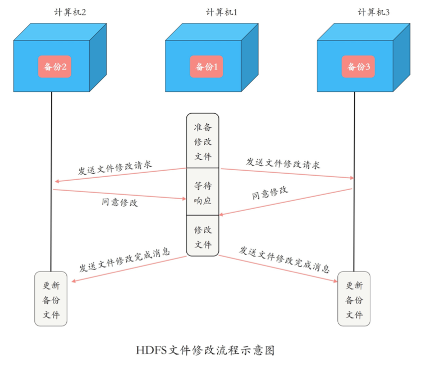

# 分布式互斥

## 什么是分布式互斥

多个进程共同争抢共同的资源，但是只有一个能够获得资源的使用，这就可以叫做分布式互斥（Distributed Mutual Exclusion）。

而这种被互斥访问的共享资源就叫作临界资源(Critical Resource)。

## 集中式方法

### 算法

1. 引入一个协调者程序 
2. 每个程序在需要访问临界资源时，先给协调者发送一个请求 。
   1. 如果当前没有程序使用这个资源，协调者直接授权请求程序访问 
   2. 否则，按照先来后到的顺序为请求程序排队
   3. 如果有程序使用完资源，则通知协调者，协调者从排队队列中取出相应的请求者并授予访问临界资源的权利

### 消息交互

一个程序完成一次临界资源访问，需要如下几个流程和消息交互: 

1. 向协调者发送请求授权信息，1次消息交互;
2. 协调者向程序发放授权信息，1次消息交互;
3. 程序使用完临界资源后，向协调者发送释放授权，1次消息交互。 

### 优缺点

1. 优点
   1. 算法简单，易于实现
2. 缺点
   1. 协调者会成为系统的性能瓶颈 
   2. 容易引发单点故障问题 

## 分布式方法

### 算法

针对集中式方法的缺点，我们是不是可以不用这个单一的协调者呢？也就是说，当一个程序要访问临界资源时，先向系统中的其他程序发送一条请求消息，在接收到所有程序返回的同意消息后，才可以访问临界资源。其中，请求消息需要包含所请求的资源、请求者的ID，以及发起请求的时间。 

可以从下面的例子看到这个算法的流程

上图中，箭头上面的8， 12代表的时刻，也就是说在时刻8和时刻12，程序1和程序3发起了访问资源A的请求，而程序2在这个过程中没有访问资源A的请求。

注意，这个集群中一共三个进程，如果他们需要访问一个共享资源，需要向该集群中的所有其他进程发送消息。

### 消息交互

1. 向其他n-1个程序发送访问临界资源的请求，总共需要n-1次消息交互;
2. 需要接收到其他n-1个程序回复的同意消息，方可访问资源，总共需要n-1次消息交互。 

可以看出，要访问一个临界资源时，需要消息量是非常可观的，当集群的数据增大时，消息量会激增

### 优缺点

1. 缺点
   1. 当系统内需要访问临界资源的程序增多时，容易产生“信令⻛暴”，也就是程序收到的请求完全超过了自己的处理能力，而导致自己正常的业务无法开展。 
   2. 一旦某一程序发生故障，无法发送同意消息，那么其他程序均处在等待回复的状态中，使得整个系统处于停滞状态，导致整个系统不可用。所以，相对于集中式算法的协调者故障，分布式算法的可用性更低。 
2. 改进
   1. 如果检测到一个程序故障，则直接忽略这个程序，无需再等待它的同意消息。 
   2. 但这样的话， 每个程序都需要对其他程序进行故障检测，这无疑带来了更大的复杂性。 

### 应用

1. Hadoop中的HDFS

   

1. 计算机1向计算机2、3发送文件修改请求;
2. 计算机2、3发现自己不需要使用资源，因此同意计算机1的请求; 
3. 计算机1收到其他所有计算机的同意消息后，开始修改该文件; 
4. 计算机1修改完成后，向计算机2、3发送文件修改完成的消息，并发送修改后的文件数据; 
5. 计算机2和3收到计算机1的新文件数据后，更新本地的备份文件。 

从上面的文件修改流程可以看到，虽然HDFS使用多副本来保证的写入数据的高可用性，但是文件的一些写入需要多个副本的同意，写入开销比较大，这也是为什么HDFS默认就是三副本设置的原因吧。如果太多了，写入性能会大幅下降的。

## 令牌环方法

### 算法

所有程序构成一个环结构， 令牌按照顺时针(或逆时针)方向在程序之间传递，收到令牌的程序有权访问临界资源，访问完成后将令牌传送到下一个程序;若该程序不需要访问临界资源，则直接把令牌传送给下一个程序。 

### 优缺点

1. 优点
   1. 在使用临界资源前，不需要像分布式算法那样挨个征求其他程序的意⻅了，所以相对而言，在令牌环算法里单个程序具有更高的通信效率 
   2. 在一个周期内，每个程序都能访问到临界资源，因此令牌环算法的公平性很好。 
2. 缺点
   1. 不管环中的程序是否想要访问资源，都需要接收并传递令牌，所以也会带来一些无效通信。当环中的节点过多时，只有等待令牌到达时才可以进行数据发送，增加了通信延迟，降低了系统的实时性。 （无人机通信中采用了令牌环算法，这个待查）

### 扩展

1. 两层结构的分布式令牌环算法
   1. 广域网由多个局域网组成，因此在该算法中，局域网是较低的层次，广域网是较高的层次。每个局域网中包含若干个局部进程和一个协调进程。局部进程在逻辑上组成一个环形结构，在每个环形结构上有一个局部令牌T在局部进程间传递。局域网与局域网之间通过各自的协调进程进行通信，这些协调进程同样组成一个环结构，这个环就是广域网中的全局环。在这个全局环上，有一个全局令牌在多个协调进程间传递。 

# 分布式一致性协议

##Paxos

##raft

### 具体过程

1. 动画展示

   http://thesecretlivesofdata.com/raft/

2. 过程
   1. 每个节点可以有三种状态
      * Follower
      * Candidate
      * Leader
3. leader election
   1. 在系统刚开始的时候，所有的节点都是Follower的状态
   2. 如果follower在一段时间内听不到leader的心跳，则它们自己就会变成Candidate
      1. 每个节点的这个时间是随机的，从150ms到300ms, **election timeout**
   3. 一个节点的超时时间一旦到达，它就把自己变成Candidate，并向其他节点发送vote，vote自己为leader
   4. 如果一个candidate获取了半数的vote，那么它就是新的leader了
4. Log Replication
   1. 后面所有的修改都是通过leader的
   2. 每个修改都被append到节点的log中，但是log并没有commit，所以节点的值还不会被更新
   3. leader会把这次修改发送到它的follower节点中
   4. 当有超过半数的节点回复的时候，leader节点就会把这次的修改commit
   5. 之后，leader再想follower发送一个心跳包(发送间隔为 **heartbeat timeout**)，告知commit这个log
5. 在四个节点的集群中，如果有两个节点同时成为了candidate，并且也恰好另外两个节点各成为其中一个节点的follower，形成一个2v2的局面，那么这个时候是选不出leader，需要再重新等待一个election timeout重新选举
6. 在一个5个节点的集群中，如果出现了脑裂，比如说一个两个节点，一个三节点，原来的主在二节点的网络分区中，那么经过一次选举，三个节点的分区中，会重新选出主来，那么原来5个节点的集群，就有两个master节点了。但是集群的配置还是5，这个时候，只有想那个只有三个节点的分区写入才能写入成功，只有两个节点的那个分区写入永远都不能成功，这是因为，只有两个节点，不能达到集群规模的半数以上，达不成一致。
   
   1. 当网络恢复后，2节点网络分区，会收到比自己大的election term， 所以要把之前接受到的一些更新回退

### 应用

1. redis的sentinel